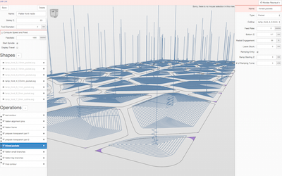
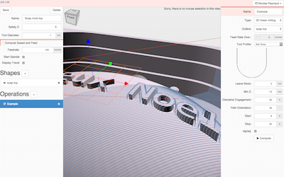
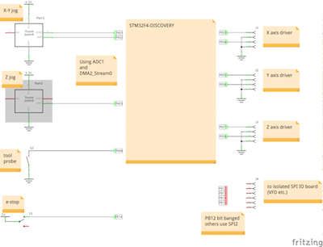
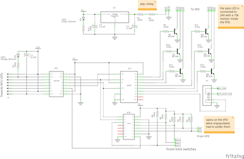
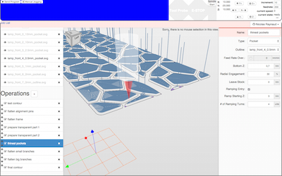

Webgcode
========
The beginning of a browser integrated CNC milling machine.

A bit of History
================

I have a Mac, and there are no real software to control a milling machine from that kind of computer. I decided to hack 
some random pieces of technology together.
Other people might be interested so I did everything in web technologies for easy trial.

I am trying to remove the dependency on g-code, because I don't like it, but I might retain some compatibility, so that 
users can tip toe into the system.

I started by creating a g-code parser with a viewer, and generated the steps from that and was able to send them to the embedded system. 
That's when I decided on the name of the project. 

Today, there is no explicit way to send some g-code into the system. 
The parser is there, it's plugged etc. I just don't have an UI to put it into the system. 
I'm really into creating my own toolpath now, so it's an incentive to develop the code when I need something. 
It's also a trap, because anything new (say a drag knife, a laser head or an extruder) needs few weeks of development before being able to use it.

Web Stuff
---------

 

A preliminary CAM system for toolpath generation is present here: http://nraynaud.github.io/webgcode/webapp/visucamTest.html#/

The application can import (drop the file on the window) STL, SVG, gerber and excellon file formats.

There is a g-code simulator here: http://nraynaud.github.io/webgcode/ (that's where the name of the project comes from).

Controller Board
----------------

The controller is a STM32F4-DISCOVERY board directly connected to the stepper drivers isolators (open drain configuration).
There is a USB cable between the board and the laptop, where a Chrome application controls the machine.
The controller is quite dumb, it gets a list of steps, direction and their timing from the computer and executes them. 
The interpolation is entirely done offline on the computer.

Pushing the user button (blue) enter the manual control mode, receiving a program on USB automatically exits the manual mode.
The orange LED is on when manual is on. The manual control is made through joysticks.

The controller is also connected to the VFD through an SPI isolated breakout board.

The wiring is described in the [main.c](interpolator/main.c#L10) and [manual.c](interpolator/manual.c#L11) files.

Yes, I called the directory "interpolator" and no, there is no interpolation code in it.

IO Board
--------

There is an IO board to connect the MCU to various things, mainly the Huanyang VFD. On this last one, the output 
optoisolators (UPF and DRV) were not populated, so I just bought some on eBay and soldered them on (ok, I admit, I might
 have shorted the pins while the chips were in the mail, please don't tell my mom, yes she knows what 300VDC is, 
 she taught me when I was a kid).
The board consists of one 74HC595 and one 74HC165, behind a digital isolator; the MCU communicates over SPI to get isolated IOs.

Chrome Application
------------------

On the computer, you can send the program to the machine. The application's main part is simply an iframe with the normal 
CAM html page in it (they talk with messages).

The USB protocol is custom since I couldn't find any standard, tell me if you know of any USB protocol to send sequences 
of steps to a machine (there is no g-code interpolator in the embedded system).

This is all Chrome technology in the hope to remove OS re-compilation/deployment efforts.

License
-------

This code is licensed under MIT and Affero GPL double licensing.

Contact
-------

To contact me about anything, you can use the issues system, there is no traffic on it.
